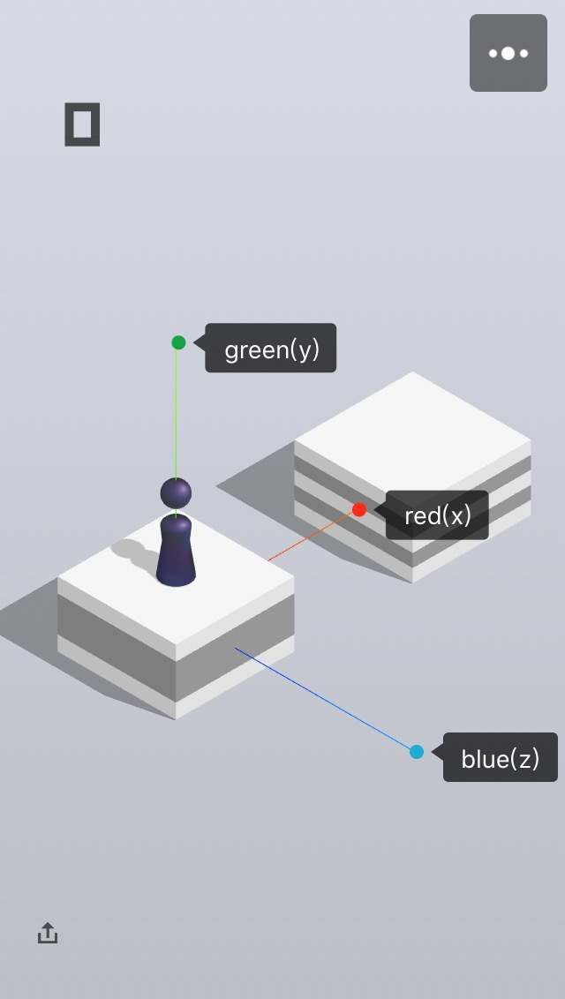
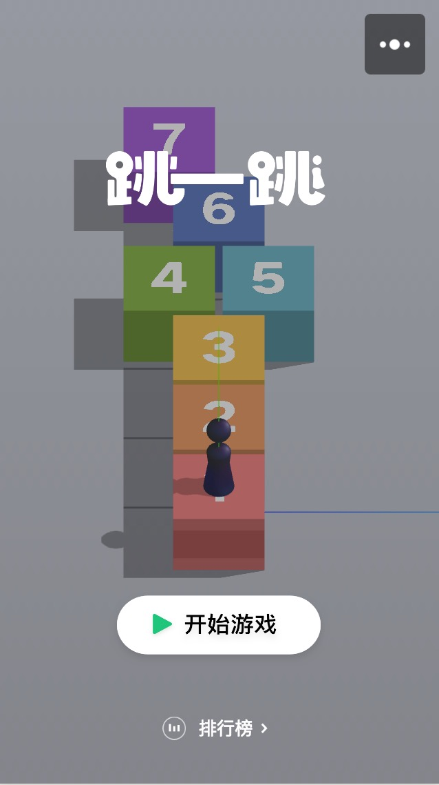

# 游戏源码分析

## 坐标轴

打开 AxisHelper 之后看到游戏的 x, y, z 轴分布，得知相机位于 xz 平面“后侧”：



初始相机位置在：

```javascript
this.camera.position.set(-17, 30, 26)
this.camera.lookAt(new o.Vector3(13, 0, -4))
```

尝试掰正看看：

```javascript

this.camera.position.set(-17, 30, 0)
this.camera.lookAt(new o.Vector3(13, 0, 0))
```


当我们向右上方（东北方向）跳跃时，其实是在 x 轴上跳。

当我们向左上方（西北方向）跳跃时，其实是在 z 轴上跳。

当我们跳跃时，头顶为 y 轴。

## 按压时间

```javascript
var holding = (Date.now() - t.mouseDownTime) / 1e3
```

按压时长设为 holding，由起跳速度为：

```javascript
velocityY = 135
velocityYIncrement = 15
velocityZIncrement = 70

bottle.velocity.vz = Math.min(holding * velocityZIncrement, 150)
bottle.velocity.vy = Math.min(velocityY + holding * velocityYIncrement, 180)

// 由源码得知飞行时间为 0.4 秒
// 右飞时：
x = vz * t
  = 0.4vz
  = 0.4 * Math.min(holding * velocityZIncrement, 150)
  = 0.4 * Math.min(holding * 70, 150)
// 若 holding * 70 < 150
x = 0.4 * holding * 70
  = 28 * holding
// 否则
x = 0.4 * 150 = 60

// 假设三维坐标与手机屏幕坐标转换函数为 x_2d = f(x_3d)
// 则:
x_2d = f(x_3d) = f(x) = f(60 or 28 * holding)
// 转换规则对three.js暂不熟悉


```

在 touchend 事件中可以控制很多东西。比如：

```javascript
// 强制只向 x 轴（即东北方向）跳
t.straight = 1

// 这是设置下一个方块与本当前方块的距离
// 其中 minDistance = 1, maxDistance = 17
t.distance = minDistance + A.random() * (maxDistance - minDistance)
           = 1 + random() * (17 - 1)
           = 1 + 16 * random()

// 其中以下不知是否为防作弊代码：
// 两次时间大于 800 毫秒，那么可能导致，判断为“慢”，有可能是在作弊
t.quick = Date.now() - t.lastSucceedTime < 800 || !1
t.quickArr.push(t.quick)
// 发送给服务器
t.gameSocket.sendCommand()
```
